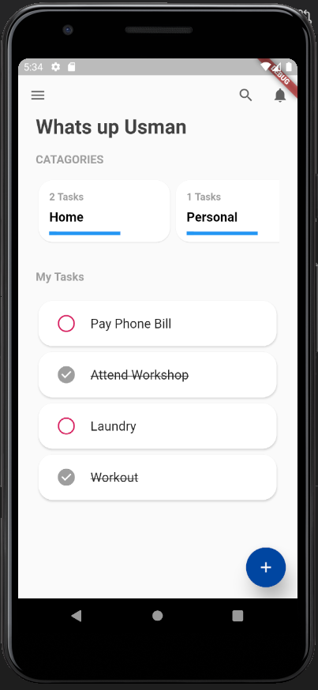
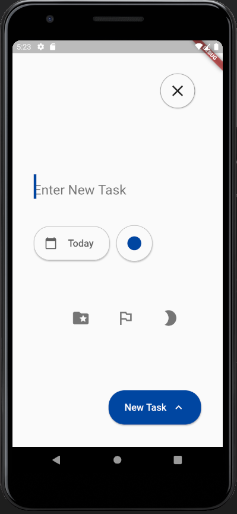
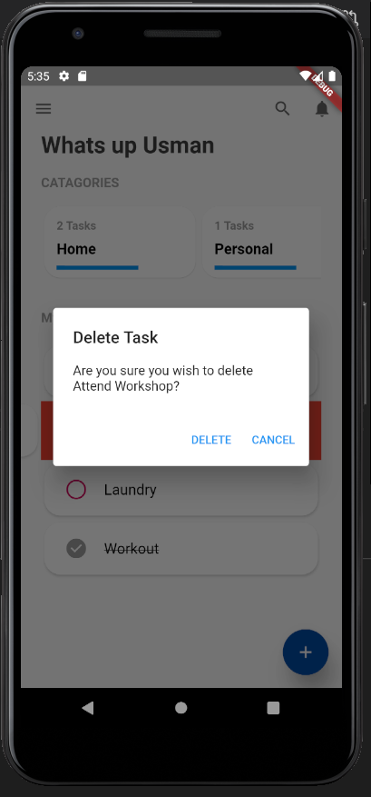
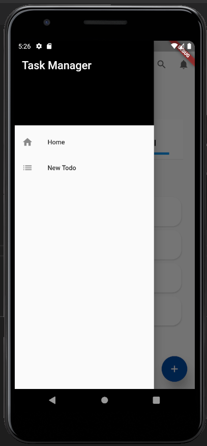

# Flutter Todo App
- App in flutter interacts with rest api using JSON data. Async/Await for fetching data using http package flutter.

# App Functionality 

- 1. Views users todos on the home screen with listview. Catagories are shown in cards using horizontal scrollable. GET call to backend api to retrive data
- 2. Users can add new todos using the floating action button. One added UI updates to add the newly added todo. POST call to backend api to add data
- 3. Update the completed status of the todo using the radio button updates the UI and backend db using PUT call
- 4. Allows users to delete the todo using the swipe to dismiss feature. Todo is removed from UI upon deletion. DELETE call to the back api with id of the todo to be deleted

# App Screenshots

# Home Screen

# Create Todo

# Delete Todo

# Side Nav

